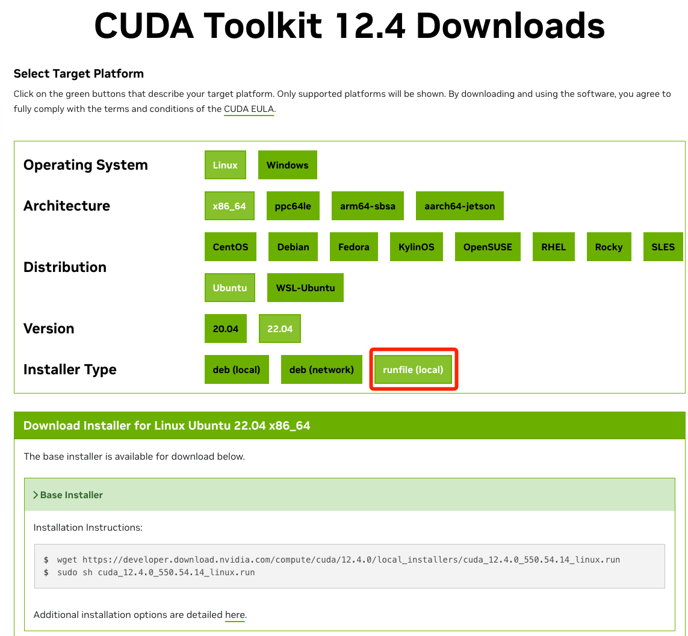

# AI 全栈开发快速入门指南


## 拉取代码

你可以通过克隆此仓库到你的本地机器来开始：

```shell
git clone https://github.com/DjangoPeng/deepseek-quickstart.git
```

然后导航至目录，并按照单个模块的指示开始操作。

## 搭建开发环境

本项目使用 Python v3.13 开发，完整 Python 依赖软件包见[requirements.txt](requirements.txt)。

关键依赖的官方文档如下：

- Python 环境管理 [Miniconda](https://docs.conda.io/projects/miniconda/en/latest/)
- Python 交互式开发环境 [Jupyter Lab](https://jupyterlab.readthedocs.io/en/stable/getting_started/installation.html)
- [OpenAI Python SDK](https://github.com/openai/openai-python?tab=readme-ov-file#installation) 


*⚠️注意：DeepSeek API 使用与 OpenAI 兼容的 API 格式，通过修改配置，您可以使用 OpenAI SDK 来访问 DeepSeek API，或使用与 OpenAI API 兼容的软件。*


**以下是详细的安装指导（以 Ubuntu 22.04 操作系统为例）**：

---

### （可选）安装 CUDA Toolkit 和 GPU 驱动

*如果对数据保护和隐私安全有要求，需要私有化部署请搭建以下 GPU 开发环境*


根据你的操作系统和架构，找到对应的 [CUDA 12.04 版本](https://developer.nvidia.com/cuda-downloads?target_os=Linux&target_arch=x86_64&Distribution=Ubuntu&target_version=22.04&target_type=runfile_local)：

下载并安装 CUDA 12.04 Toolkit（包含GPU驱动）：

```shell
wget https://developer.download.nvidia.com/compute/cuda/12.4.0/local_installers/cuda_12.4.0_550.54.14_linux.run
sudo sh cuda_12.4.0_550.54.14_linux.run
```

**注意使用`runfile`方式，可以连同版本匹配的 GPU 驱动一起安装好。**




安装完成后，使用 `nvidia-smi` 指令查看版本：

```shell
nvidia-smi          
Mon Dec 18 12:10:47 2023       
+---------------------------------------------------------------------------------------+
| NVIDIA-SMI 535.129.03             Driver Version: 535.129.03   CUDA Version: 12.2     |
|-----------------------------------------+----------------------+----------------------+
| GPU  Name                 Persistence-M | Bus-Id        Disp.A | Volatile Uncorr. ECC |
| Fan  Temp   Perf          Pwr:Usage/Cap |         Memory-Usage | GPU-Util  Compute M. |
|                                         |                      |               MIG M. |
|=========================================+======================+======================|
|   0  Tesla T4                       Off | 00000000:00:0D.0 Off |                    0 |
| N/A   44C    P0              26W /  70W |      2MiB / 15360MiB |      6%      Default |
|                                         |                      |                  N/A |
+-----------------------------------------+----------------------+----------------------+
                                                                                         
+---------------------------------------------------------------------------------------+
| Processes:                                                                            |
|  GPU   GI   CI        PID   Type   Process name                            GPU Memory |
|        ID   ID                                                             Usage      |
|=======================================================================================|
|  No running processes found                                                           |
+---------------------------------------------------------------------------------------+
```

---

### 安装 Miniconda

```shell
mkdir -p ~/miniconda3
wget https://repo.anaconda.com/miniconda/Miniconda3-latest-Linux-x86_64.sh -O ~/miniconda3/miniconda.sh
bash ~/miniconda3/miniconda.sh -b -u -p ~/miniconda3
rm -rf ~/miniconda3/miniconda.sh
```

安装完成后，建议新建一个 Python 虚拟环境，命名为 `deepseek`。

```shell
conda create -n deepseek python=3.13

# 激活环境
conda activate deepseek 
```

之后每次使用需要激活此环境。


### 安装 Python 依赖软件包

```shell
pip install -r requirements.txt
```

### 配置 DeepSeek API Key

根据你使用的命令行工具，在 `~/.bashrc` 或 `~/.zshrc` 中配置 `DEEPSEEK_API_KEY` 环境变量：

```shell
export DEEPSEEK_API_KEY="xxxx"
```

### 安装和配置 Jupyter Lab

上述开发环境安装完成后，使用 Miniconda 安装 Jupyter Lab：

```shell
conda install -c conda-forge jupyterlab
```

使用 Jupyter Lab 开发的最佳实践是后台常驻，下面是相关配置（以 root 用户为例）：

```shell
# 生成 Jupyter Lab 配置文件，
jupyter lab --generate-config
```

打开上面执行输出的`jupyter_lab_config.py`配置文件后，修改以下配置项：

```python
c.ServerApp.allow_root = True # 非 root 用户启动，无需修改
c.ServerApp.ip = '*'
```

使用 nohup 后台启动 Jupyter Lab
```shell
$ nohup jupyter lab --port=8000 --NotebookApp.token='替换为你的密码' --notebook-dir=./ &
```


Jupyter Lab 输出的日志将会保存在 `nohup.out` 文件（已在 .gitignore中过滤）。


## 贡献

贡献是使开源社区成为学习、激励和创造的惊人之处。非常感谢你所做的任何贡献。如果你有任何建议或功能请求，请先开启一个议题讨论你想要改变的内容。

<a href='https://github.com/repo-reviews/repo-reviews.github.io/blob/main/create.md' target="_blank"></a>

## 许可证

该项目根据Apache-2.0许可证的条款进行许可。详情请参见[LICENSE](LICENSE)文件。